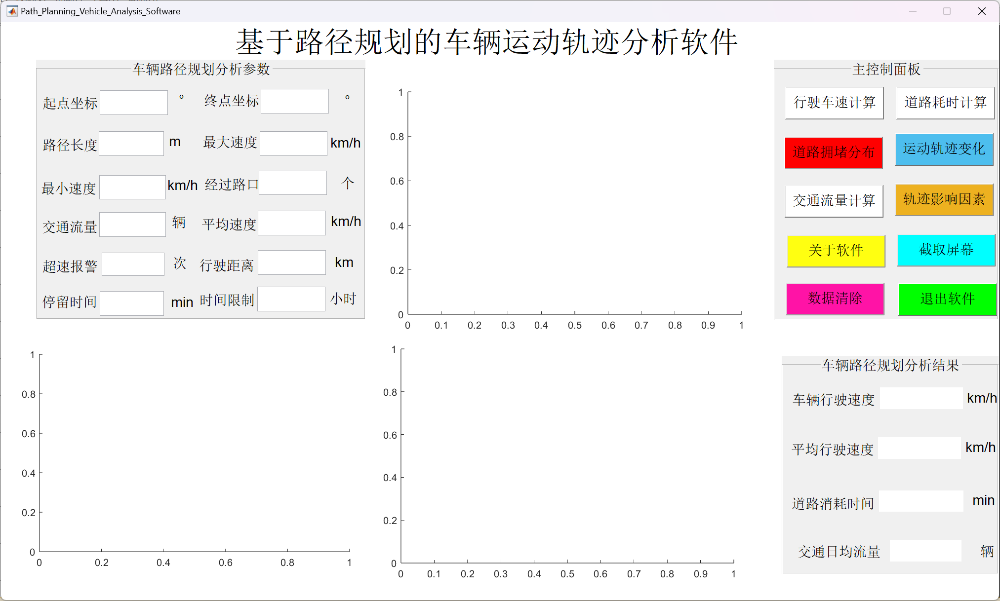
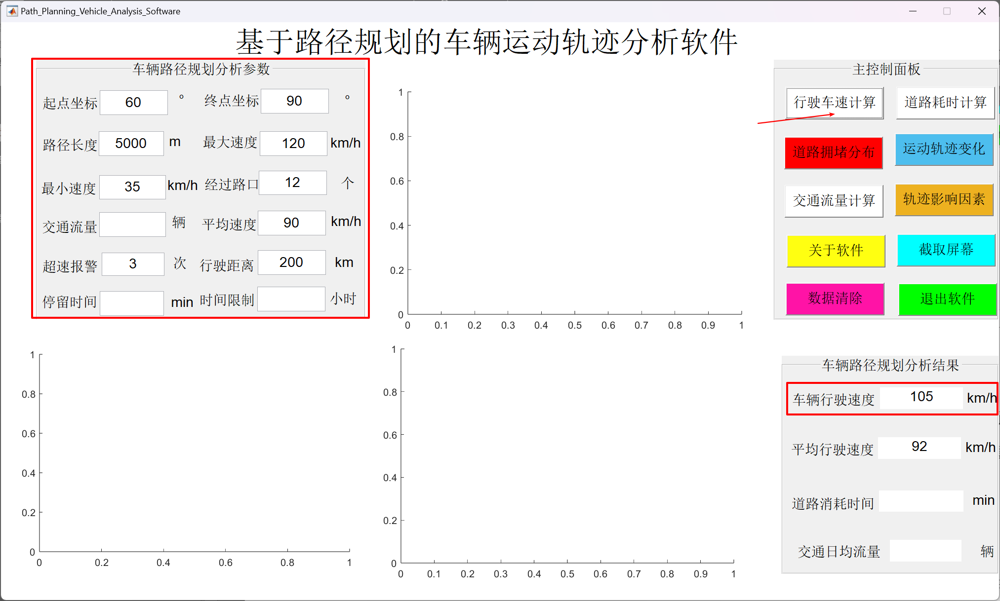
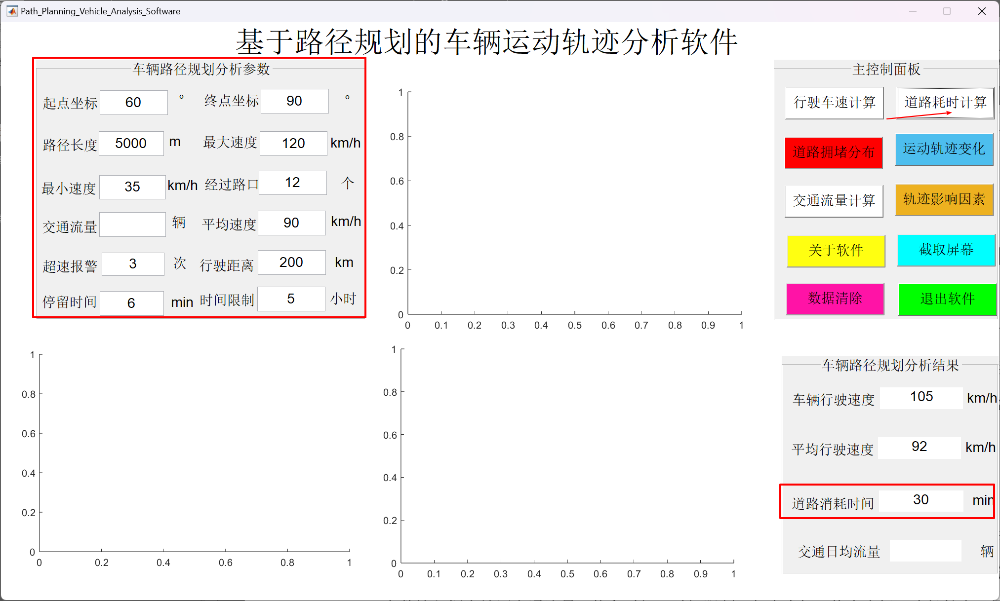
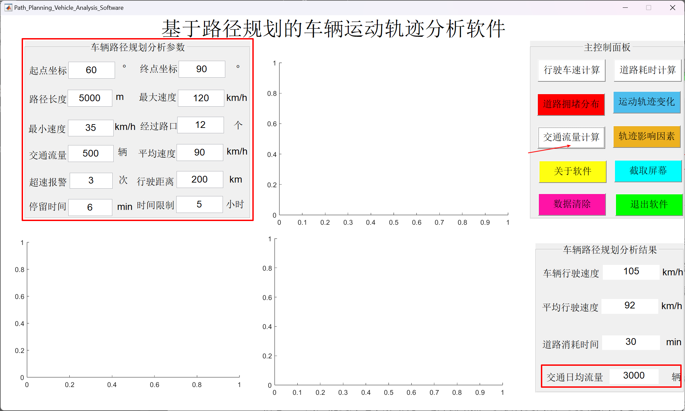
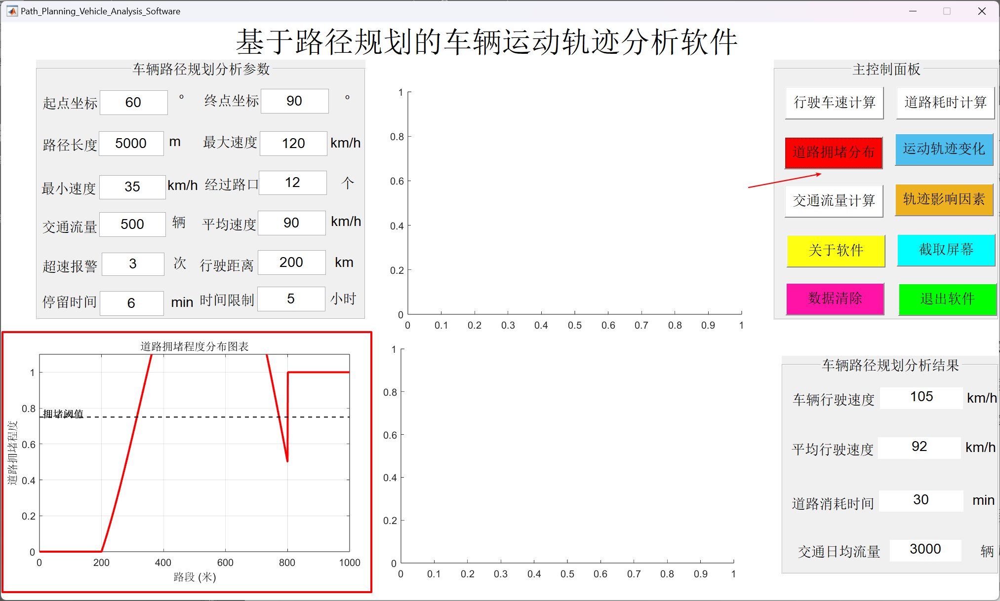
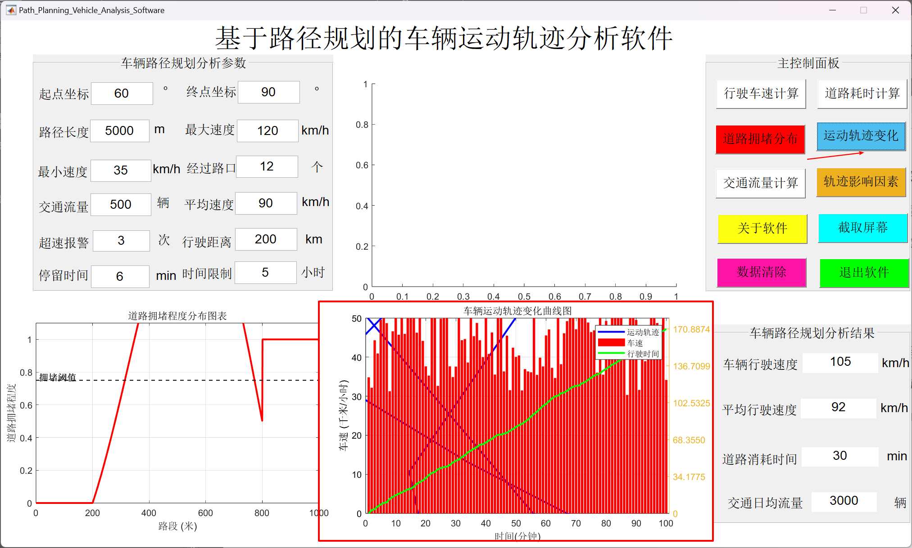
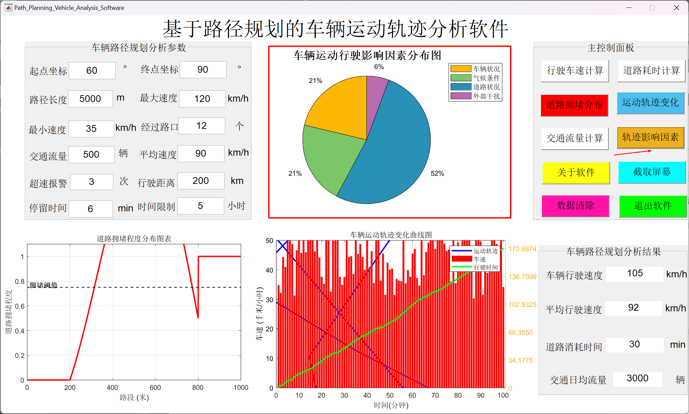
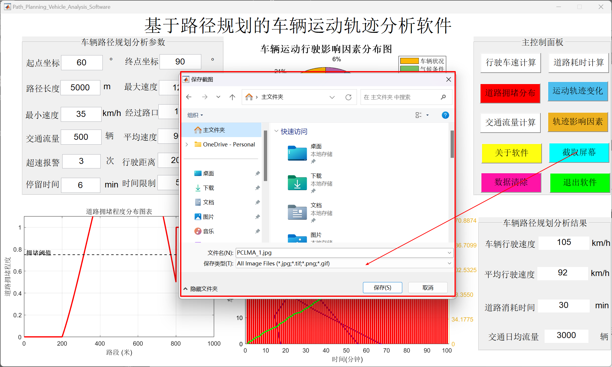

# **Vehicle Trajectory Analysis Based on Path Planning**

------

## Introduction

This project is a MATLAB-based software for vehicle path planning and motion trajectory analysis. It integrates functionalities such as speed calculation, road travel time analysis, traffic flow estimation, congestion visualization and so on, which are suitable for urban traffic management, intelligent transportation systems, and autonomous driving path research. 

  


The software can run on Windows 10 (64-bit) systems without requiring a full MATLAB installation. Only the MATLAB Compiler Runtime (MCR) is needed.  

------

## Project Structure

```text
- Path_Planning_Vehicle_Analysis_Software.m  
- Path_Planning_Vehicle_Analysis_Software.fig  
- README.md  
- Path_Planning_Vehicle_Analysis_Software
    ├── for_redistribution  
    │   └── AppInstaller_web.exe  
    ├── for_redistribution_files_only  
    │   ├── Path_Planning_Vehicle_Analysis_Software.exe  
    │   ├── readme.txt  
    │   └── splash.png  
    └── for_testing  
        ├── mccExcludedFiles.log  
        ├── Path_Planning_Vehicle_Analysis_Software.exe  
        ├── readme.txt  
        ├── requiredMCRProducts.txt  
        ├── splash.png  
        └── unresolvedSymbols.txt  
```

------

## Development Environment

- **MATLAB**：R2021a (64-bit)
- **MATLAB compiler**：2.1
- **operating system**：Windows 10 (64-bit)

------

## Install and Run

1. Clone the repository:

   ```bash
   git clone https://github.com/mason-ching/VehicleTrajectoryAnalysis.git
   cd VehicleTrajectoryAnalysis
   ```

2. Install dependencies:

   - MATLAB R2021a (or newer) or MATLAB Compiler 2.1 (or newer).

3. Run the software: 

   - Open `Path_Planning_Vehicle_Analysis_Software.m` and click "Run" in MATLAB.
   - Alternatively, execute the pre-built .exe file at `Path_Planning_Vehicle_Analysis_Software/for_redistribution_files_only/Path_Planning_Vehicle_Analysis_Software.exe`

------

## Guide

1. **Initialization**: Ensure MATLAB Compiler Runtime is installed. Launch the application via double-click or command line.
2. **Input**: Fill in path coordinates, speed, dwell time, etc., in the left panel.
3. **Execute**: Click corresponding buttons to dynamically generate charts and results.
4. **Export**: Right-click to copy images or use the "Screen Capture" to save outputs.

------

## Key Features

1. **Speed Calculation**: Input start/end coordinates and speed parameters to compute optimal driving speed.



2. **Travel Time Analysis**: Evaluate trip duration based on dwell time and road segment length.



3. **Traffic Flow Analysis**: Visualize real-time traffic flow impact on path planning.



4. **Congestion Distribution Map**: Generate road congestion intensity distribution maps.



5. **Trajectory Curve**: Display dynamic vehicle trajectory variations over time.



6. **Impact Factor Visualization**: Highlight distributions of critical impact factors like road conditions, weather, and intersections.



7. **Export Results**: Support to export results by screen captures.



------

## License

This project is licensed under the [MIT License](LICENSE). It also serves as the final coursework for MATLAB Course at School of Mathematics and Statistics, Henan University.
